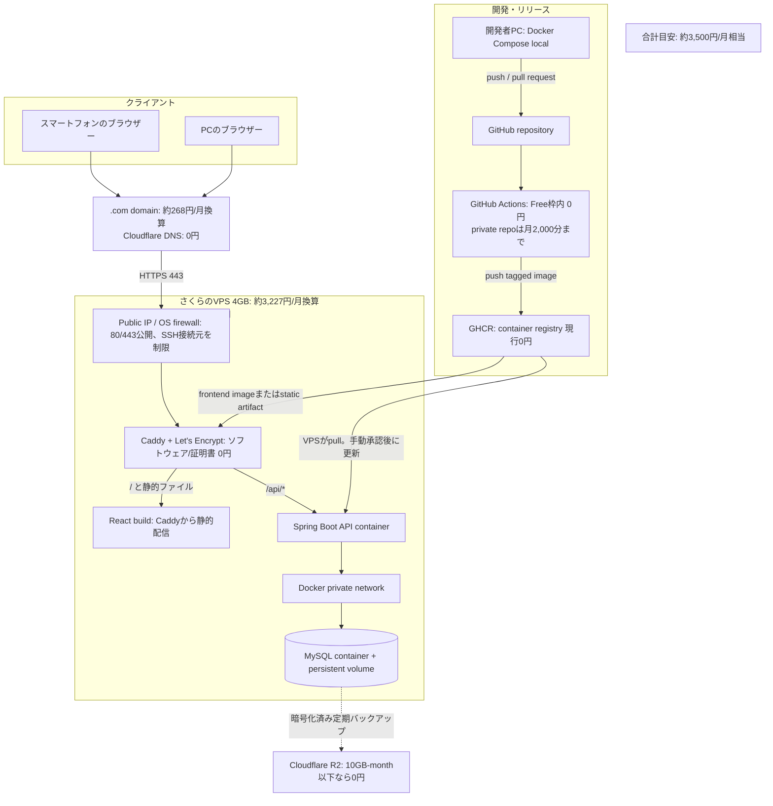
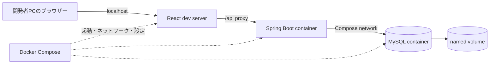
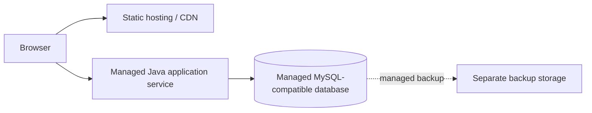

# アーキテクチャ設計書

## 1. 文書情報

| 項目 | 内容 |
| --- | --- |
| バージョン | 1.0 |
| 状態 | 初期公開案。VPS・ドメイン・バックアップ先は契約前に確定 |
| 作成日 | 2026-09-26 |
| 関連文書 | [概要設計書](overview-design.md)、[インフラ・運用設計書](detailed-design/infrastructure-design.md) |
| 対象読者 | 全開発者、インフラ担当、運用担当 |

## 2. アーキテクチャの決定方針

初期公開は、**1台の低価格VPS上でDocker Composeを動かす構成**を第一候補とする。Reactの静的ファイル、Caddy、Java Spring Boot API、MySQLを同じVPS上に配置する。自宅PCを常時稼働させて公開する構成は、停電・回線・保守の影響が大きいため初期公開には採用しない。

具体的な候補は次のとおり。これは採用確定ではなく、料金・仕様を比較する際の基準案である。

| 役割 | 初期候補 | 採用理由・留意点 |
| --- | --- | --- |
| ソース管理 | GitHub | ソース、設計書、レビューを共有 |
| CI | GitHub Actions | PRでテストとイメージビルドを実施。無料枠は利用条件を確認 |
| コンテナ保管 | GitHub Container Registry (GHCR) | CIで作った本番イメージをVPSへ渡す |
| 公開サーバー | さくらのVPS等の日本リージョンVPS | 1台でComposeを学べ、MySQLを含めた配置を管理できる |
| OS | Ubuntu Server LTS等 | サポート期間、Docker対応、セキュリティ更新を確認 |
| HTTPS/リバースプロキシ | Caddy | HTTPS終端、Let's Encrypt証明書管理、SPA配信とAPI振り分け |
| TLS証明書 | Let's Encrypt | Caddyによる自動取得・更新を想定 |
| アプリDB | MySQL | ローカル開発と公開のDB製品を統一 |
| バックアップ保存 | VPSとは別のS3互換オブジェクトストレージ等 | 事業者・料金・暗号化・復元方法を別途選定 |
| ドメイン/DNS | ドメイン登録事業者とDNSサービス | ドメイン料金、DNS管理、更新責任を公開前に決める |

VPS、ドメイン、バックアップ保存には料金が発生する可能性がある。正確な月額料金、リージョン、メモリ、ディスク、バックアップ機能は契約時点で公式情報を確認する。無料枠を恒久的な前提にしない。

## 3. 公開環境アーキテクチャ

### 3.1 料金の目安（2026-09-26確認）

| サービス/項目 | 概算 | 見積もり条件 |
| --- | ---: | --- |
| さくらのVPS 4GB | 約3,227円/月 | 年額38,720円を12か月で按分。月払いの場合は異なる可能性がある。Java・MySQLを同居させるための推奨案 |
| さくらのVPS 2GB（参考） | 約1,594円/月 | 年額19,118円の按分。約1,862円/月相当まで下がるが、JVM・MySQL・OSを同居させるにはメモリ余裕が小さいため非推奨 |
| `.com`ドメイン | 3,220円/年（約268円/月） | さくらのドメイン掲載価格。更新時価格、キャンペーン、TLD変更は別途確認 |
| Cloudflare DNS | 0円 | Freeプランの範囲で利用する想定。ドメイン取得費用は別 |
| Caddy / Let's Encrypt | 0円 | ソフトウェアと証明書の利用料。VPS運用作業は別 |
| GitHub Actions | 0円の想定 | private repositoryのGitHub Free枠は月2,000 runner分。超過・より大きなrunnerは別料金 |
| GHCR | 現行0円の想定 | GitHubはContainer registryのイメージ保管・帯域を現在無料としている。ポリシー変更に備えて契約時に再確認 |
| Cloudflare R2バックアップ | 0円の想定 | Standard storage 10 GB-month、月100万Class A・1,000万Class B操作まで。超過分はStorageが$0.015/GB-month。Egressは無料 |
| **合計** | **約3,495円/月相当（約3,500円）** | 4GB VPS + `.com`ドメインの年額按分。DNS、Caddy、証明書、規定内CI/バックアップ枠が無料の前提 |

この概算には、開発者の作業時間、個別サポート、バックアップ10GB超過、GitHub Actionsの無料枠超過、ドメイン価格改定は含めない。Cloudflare R2はバックアップ総量と操作数が無料枠内である場合に限り0円となる。VPSの年払いでは初回に年額の支払いが必要で、月払いの価格や最低利用期間は申込画面で確認する。価格は変わりうるため、契約直前に再確認する。

参照した公式価格情報:
- さくらのVPS料金: https://vps.sakura.ad.jp/specification/
- さくらのドメイン料金: https://domain.sakura.ad.jp/
- Cloudflare R2料金: https://developers.cloudflare.com/r2/pricing/
- GitHub Actions料金: https://docs.github.com/en/billing/concepts/product-billing/github-actions
- GitHub Packages/GHCR料金: https://docs.github.com/en/billing/concepts/product-billing/github-packages

### 3.2 リクエスト経路

1. 利用者のブラウザーが独自ドメインへHTTPS接続する。
2. DNSがVPSのIPアドレスを返す。
3. VPSのファイアウォールが80/443を受け付ける。SSHは鍵認証とし、可能なら接続元を制限する。
4. CaddyがTLSを終端する。HTTPアクセスはHTTPSへ転送する。
5. CaddyはReactの静的ファイルを配信し、`/api/*`だけをSpring Bootコンテナへ転送する。
6. Spring BootはDockerのprivate network経由でMySQLへ接続する。
7. MySQLはnamed volumeへデータを永続化する。DBポートはホスト/インターネットへ公開しない。

### 3.3 デプロイ経路

1. 開発者がGitHubへPull Requestを作成する。
2. GitHub Actionsがフロントエンド/バックエンドのテストとコンテナビルドを行う。
3. mainへのマージ後、承認されたタグ付きイメージをGHCRへpushする。
4. 初期運用ではAdminがVPS上でComposeイメージを更新し、マイグレーション・healthcheck・疎通を確認する。
5. 自動デプロイを追加する場合、GitHub ActionsのEnvironment承認と、権限を限定したSSH鍵/トークンを使う。root鍵や本番DB資格情報をActionsへ渡さない。

CIとGHCRの無料利用枠・イメージ保管上限は変更されうるため、利用開始時に確認する。開発ブランチ用イメージと本番イメージはタグで区別し、`latest`だけに依存しない。

## 4. ローカル開発アーキテクチャ

ローカルと本番は同じDB製品（MySQL）を用いる。本番のCaddy/TLS経路はローカルでは省略または開発用proxyで代替できる。DBデータはnamed volumeに保持し、通常停止とボリューム削除を区別する。

## 5. サービス間の境界とポート

| コンポーネント | 公開範囲 | 接続先 |
| --- | --- | --- |
| Caddy | インターネットから80/443 | ブラウザー、frontend静的ファイル、Spring Boot |
| Spring Boot | Docker private networkのみ | Caddy、MySQL |
| MySQL | Docker private networkのみ | Spring Bootのみ |
| SSH | 管理用途。可能なら接続元IP制限 | Adminの管理端末 |
| GitHub Actions | GitHub管理のCI環境 | GHCR。デプロイ時のみ限定SSH接続 |
| Backup storage | アプリから暗号化データを書き込み | VPSとは独立したストレージ事業者 |

本番ではMySQLの3306番ポートをインターネットへ公開しない。APIコンテナも直接公開せず、Caddy経由だけにする。

## 6. データ、秘密情報、バックアップ

- MySQLデータはnamed volumeに保存する。volumeは障害・VPS停止に対するバックアップではない。
- DBパスワード、GitHub/GHCR資格情報、デプロイ鍵はGitへコミットせず、ホスト上の制限された環境ファイルまたはSecret Storeを使う。
- バックアップはMySQL dump等を暗号化し、VPSとは別事業者のストレージへ保存する。ストレージのライフサイクルとアクセス権を設定する。
- バックアップ頻度は初期案として日次、保持期間は直近30日を候補とし、費用・記録頻度・損失許容時間を見て確定する。
- バックアップから別環境への復元テストを公開前に行う。CSVエクスポートは初期リリースに含めないため、利用者向け代替手段として扱わない。
- 係数マスタの変更とアプリのバージョンを記録し、過去の消費カロリー推定値は記録時のスナップショットを維持する。

## 7. 単一VPS案の評価

### 利点

- フロント、API、DBが同一のComposeネットワークにあり、構成と通信を理解しやすい。
- 初期の少人数利用では構成が過剰になりにくい。
- ローカル開発と本番でDocker Compose/MySQLの概念を共通化できる。
- DBを専用マネージドサービスに分離するより月額を抑えられる可能性がある。

### リスクと対策

- VPS障害がフロント/API/DBすべてに影響する。別事業者のバックアップと復元手順を持つ。
- OS・Docker・MySQLの更新を自分で管理する。更新前にバックアップとステージング確認を行う。
- 無料ホスティングではない。VPS・ドメイン・外部バックアップの合計費用を契約前に提示する。
- 単一ディスク障害・誤操作・ランサムウェアに備え、同一VPS内のコピーだけをバックアップとしない。
- 停止やネットワーク断に備え、稼働監視と復旧手順を設ける。

## 8. 将来の分離構成

利用者数、可用性、保守負荷、バックアップ要件が増えた場合に、次のようなマネージド構成へ移行できる。

候補を採用する場合は、Javaの稼働時間・スリープ、無料枠/課金、DB互換性、リージョン、データ保持、バックアップ復元、外部接続制限を公式情報で確認する。TiDB Cloud Starter等のMySQL互換DBも候補だが、MySQLと全機能が同一とはみなさず、マイグレーション・統合テストを行う。

## 9. 実装前に確定する項目

1. VPS事業者、契約プラン、配置リージョン、月額予算上限。
2. ドメイン登録先、DNS管理先、更新責任者。
3. VPS firewall、SSH接続元、管理者アカウント、OS更新方法。
4. MySQL backupの頻度・保持期間・外部保存先と復元責任者。
5. GitHub repositoryの公開範囲、Actions/GHCRの利用条件、自動デプロイの承認手順。
6. 本番のDockerイメージ配置、ロールバック、Flyway失敗時の復旧手順。
7. 利用規模に対するVPSメモリ・CPU・ディスク容量の検証方法。
8. 外部サービスの料金・無料枠・規約を確認した日付と担当者。
