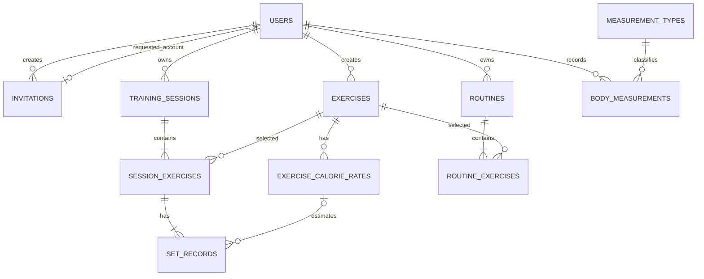

# データ設計書

## 1. 文書情報

| 項目 | 内容 |
| --- | --- |
| バージョン | 1.0 |
| 状態 | 初版案。実DDL作成時に型・長さを確定 |
| 対応する概要設計 | [overview-design.md](../overview-design.md) |
| 主な利用者 | DB/バックエンド開発者、レビュー担当 |

## 2. データ設計方針

- DBはローカル開発・結合テストでMySQLを使用する。
- 全時刻はUTC、利用者が指定するトレーニング日・測定日時は意味を分けて扱う。
- 主キー形式は実装時に統一する。本書では説明上`BIGINT`を想定する。
- 外部キーと一意制約をDBで定義し、入力検証はAPIでも実施する。
- 利用者所有データは`user_id`または親レコードを通じて所有者を特定できること。
- アカウント削除・全件削除は初期対象外。個別記録の削除は許可する。

## 3. ER図

## 4. テーブル定義

以下の型・長さは初期案。MySQLの採用バージョンを決めた後、Flyway DDLと合わせて確定する。

### 4.1 `users`

| カラム | 型・NULL | 制約 | 説明 |
| --- | --- | --- | --- |
| `id` | BIGINT NOT NULL | PK | 利用者ID |
| `username` | VARCHAR(64) NOT NULL | UNIQUE | ログイン名。正規化後の値を保存 |
| `password_hash` | VARCHAR(255) NOT NULL |  | BCrypt等でハッシュ化した値 |
| `display_name` | VARCHAR(100) NOT NULL |  | 画面表示名 |
| `role` | VARCHAR(20) NOT NULL | CHECK | `ADMIN`または`USER` |
| `status` | VARCHAR(24) NOT NULL | CHECK | `PENDING_APPROVAL`, `ACTIVE`, `REJECTED` |
| `created_at` | DATETIME(6) NOT NULL |  | 作成日時UTC |
| `updated_at` | DATETIME(6) NOT NULL |  | 更新日時UTC |

Adminは初期化時に1名作成する。初期一般利用者は2名を想定する。

### 4.2 `invitations`

| カラム | 型・NULL | 制約 | 説明 |
| --- | --- | --- | --- |
| `id` | BIGINT NOT NULL | PK | 招待ID |
| `token_hash` | CHAR(64) NOT NULL | UNIQUE | 生トークンではなくSHA-256等のハッシュ |
| `created_by_user_id` | BIGINT NOT NULL | FK users | 発行したAdmin |
| `requested_user_id` | BIGINT NULL | FK users, UNIQUE | 申請で作成された利用者 |
| `expires_at` | DATETIME(6) NOT NULL | INDEX | 有効期限UTC |
| `accepted_at` | DATETIME(6) NULL |  | 申請時刻UTC |
| `revoked_at` | DATETIME(6) NULL |  | Adminによる失効時刻UTC |
| `created_at` | DATETIME(6) NOT NULL |  | 発行時刻UTC |

有効/使用済み/失効状態は上記日時の組み合わせから判定する案。状態列を追加する場合は状態遷移を業務機能設計と一致させる。

### 4.3 `exercises`

| カラム | 型・NULL | 制約 | 説明 |
| --- | --- | --- | --- |
| `id` | BIGINT NOT NULL | PK | 種目ID |
| `owner_user_id` | BIGINT NULL | FK users, INDEX | NULLは全利用者共通の標準種目。値ありは登録者独自種目 |
| `name` | VARCHAR(100) NOT NULL |  | 種目名 |
| `category` | VARCHAR(50) NULL | INDEX | 任意カテゴリ |
| `description` | VARCHAR(500) NULL |  | 説明 |
| `created_at` | DATETIME(6) NOT NULL |  | 作成日時UTC |

独自種目の同一利用者内名称重複を防ぐ制約を設ける。標準種目データはマイグレーションまたは冪等なseedで登録する。

### 4.4 `exercise_calorie_rates`

| カラム | 型・NULL | 制約 | 説明 |
| --- | --- | --- | --- |
| `id` | BIGINT NOT NULL | PK | 係数版ID |
| `exercise_id` | BIGINT NOT NULL | FK exercises | 対象種目 |
| `basis` | VARCHAR(10) NOT NULL | CHECK | `REP`または`MINUTE` |
| `kcal_per_unit` | DECIMAL(10,5) NOT NULL | CHECK > 0 | 1回または1分あたり係数 |
| `source` | VARCHAR(255) NOT NULL |  | 算出根拠・出典 |
| `version` | INT NOT NULL | UNIQUE(exercise_id, basis, version) | 係数版 |
| `effective_from` | DATE NOT NULL |  | 適用開始日 |
| `enabled` | BOOLEAN NOT NULL |  | 新規計算への適用可否 |
| `created_at` | DATETIME(6) NOT NULL |  | 登録日時UTC |

係数行は履歴を保持し、値の変更時は既存行を上書きせず新しい版を登録する。初期係数データは初期リリース前にseedする。

### 4.5 `training_sessions`

| カラム | 型・NULL | 制約 | 説明 |
| --- | --- | --- | --- |
| `id` | BIGINT NOT NULL | PK | トレーニング記録ID |
| `user_id` | BIGINT NOT NULL | FK users, INDEX | 所有者 |
| `training_date` | DATE NOT NULL | INDEX | 利用者が記録する実施日 |
| `note` | VARCHAR(1000) NULL |  | 任意メモ |
| `created_at` | DATETIME(6) NOT NULL |  | 作成日時UTC。同日記録の並び替えに使用 |
| `updated_at` | DATETIME(6) NOT NULL |  | 更新日時UTC |

`(user_id, training_date, created_at)`の複合インデックスを持つ。同一日複数の記録を許可するため日付単独の一意制約は設けない。

### 4.6 `session_exercises`

| カラム | 型・NULL | 制約 | 説明 |
| --- | --- | --- | --- |
| `id` | BIGINT NOT NULL | PK | 記録種目ID |
| `session_id` | BIGINT NOT NULL | FK training_sessions | 親記録 |
| `exercise_id` | BIGINT NOT NULL | FK exercises | 種目 |
| `display_order` | INT NOT NULL | UNIQUE(session_id, display_order) | 記録内の表示順 |
| `note` | VARCHAR(500) NULL |  | 任意メモ |

### 4.7 `set_records`

| カラム | 型・NULL | 制約 | 説明 |
| --- | --- | --- | --- |
| `id` | BIGINT NOT NULL | PK | セットID |
| `session_exercise_id` | BIGINT NOT NULL | FK session_exercises | 親の種目記録 |
| `set_number` | INT NOT NULL | UNIQUE(session_exercise_id, set_number) | セット順。1から開始 |
| `reps` | INT NULL | CHECK > 0 | 回数形式の値 |
| `duration_seconds` | INT NULL | CHECK > 0 | 時間形式の値。秒 |
| `weight_kg` | DECIMAL(7,2) NULL | CHECK >= 0 | 任意重量kg |
| `calorie_rate_id` | BIGINT NULL | FK exercise_calorie_rates | 計算に適用した係数版 |
| `estimated_calories_kcal` | DECIMAL(10,2) NULL | CHECK >= 0 | 記録時に計算して保存したセット別推定値 |
| `created_at` | DATETIME(6) NOT NULL |  | 作成日時UTC |

CHECK制約とAPI検証で、`reps`と`duration_seconds`の片方だけがNOT NULLであることを保証する。重量はどちらの記録形式にも任意で付与できる。適用係数と推定値は記録時点のスナップショットとして保存し、係数マスタの改訂で過去値を再計算しない。

### 4.8 `routines` と `routine_exercises`

`routines`は`id`, `user_id`, `name`, `description`, `created_at`, `updated_at`を持つ。`user_id`は必須FK、`name`は必須とする。

`routine_exercises`は`id`, `routine_id`, `exercise_id`, `display_order`を持つ。各IDはPK/FKとし、`(routine_id, display_order)`を一意にする。初期仕様ではメニューにセット目標値を保存しない。

### 4.9 `measurement_types`

| カラム | 型・NULL | 制約 | 説明 |
| --- | --- | --- | --- |
| `id` | BIGINT NOT NULL | PK | 項目ID |
| `code` | VARCHAR(40) NOT NULL | UNIQUE | 内部コード（例: `height_cm`, `weight_kg`） |
| `name` | VARCHAR(80) NOT NULL |  | 表示名 |
| `unit` | VARCHAR(20) NOT NULL |  | 表示単位 |
| `display_order` | INT NOT NULL | UNIQUE | 表示順 |
| `enabled` | BOOLEAN NOT NULL |  | 入力可能状態 |
| `min_value` | DECIMAL(10,3) NULL |  | 項目固有の最小値 |
| `max_value` | DECIMAL(10,3) NULL |  | 項目固有の最大値 |

初期seedは身長(cm)と体重(kg)。将来の単純な数値項目は項目マスタ追加とし、DB列追加を不要にする。

### 4.10 `body_measurements`

| カラム | 型・NULL | 制約 | 説明 |
| --- | --- | --- | --- |
| `id` | BIGINT NOT NULL | PK | 測定ID |
| `user_id` | BIGINT NOT NULL | FK users | 所有者 |
| `measurement_type_id` | BIGINT NOT NULL | FK measurement_types | 測定項目 |
| `measured_at` | DATETIME(6) NOT NULL | INDEX | 測定日時UTC |
| `value` | DECIMAL(10,3) NOT NULL | 項目別範囲検証 | 測定値 |
| `created_at` | DATETIME(6) NOT NULL |  | 登録日時UTC |

`(user_id, measurement_type_id, measured_at)`に検索用インデックスを設ける。同日複数記録を許可し、日付単位の一意制約は設けない。

## 5. 外部キー・削除方針

- 利用者データの検索・更新・削除は、利用者IDでスコープしたクエリを使用する。
- トレーニング記録の個別削除では、所有者を検証したうえでセッション、種目項目、セットを同一トランザクションで削除する。
- メニュー削除ではメニュー種目を同一トランザクションで削除する。
- 参照された標準種目は物理削除せず、必要なら無効化する。記録済みの種目参照を壊さない。
- アカウント削除および利用者全データの一括削除は初期機能に含めない。FKは意図しないカスケード削除を防ぐ設定にする。
- 身体測定項目マスタは測定値から参照されている間は物理削除せず、`enabled=false`で新規入力を止める。

## 6. インデックスと一意性

- `users(username)` UNIQUE。
- `invitations(token_hash)` UNIQUE、`invitations(expires_at)` INDEX。
- `training_sessions(user_id, training_date, created_at)` INDEX。
- `session_exercises(session_id, display_order)` UNIQUE。
- `set_records(session_exercise_id, set_number)` UNIQUE。
- `exercise_calorie_rates(exercise_id, basis, version)` UNIQUE、および`(exercise_id, basis, enabled)` INDEX。
- `routines(user_id, name)`は必要に応じて重複を禁止する。初期案では同名メニューを許可する。
- `routine_exercises(routine_id, display_order)` UNIQUE。
- `body_measurements(user_id, measurement_type_id, measured_at)` INDEX。

## 7. マイグレーション

- 全DDL変更はFlywayの番号付きマイグレーションで管理し、既存マイグレーションを書き換えない。
- 標準種目と初期測定項目のseedは、複数回適用しても重複しない方法にする。
- ローカル・CIのテストDBは、本番DBと同じMySQLメジャーバージョンを使う。
- マイグレーションの適用順、ロールバック可否、バックアップ要否をPRで説明する。
