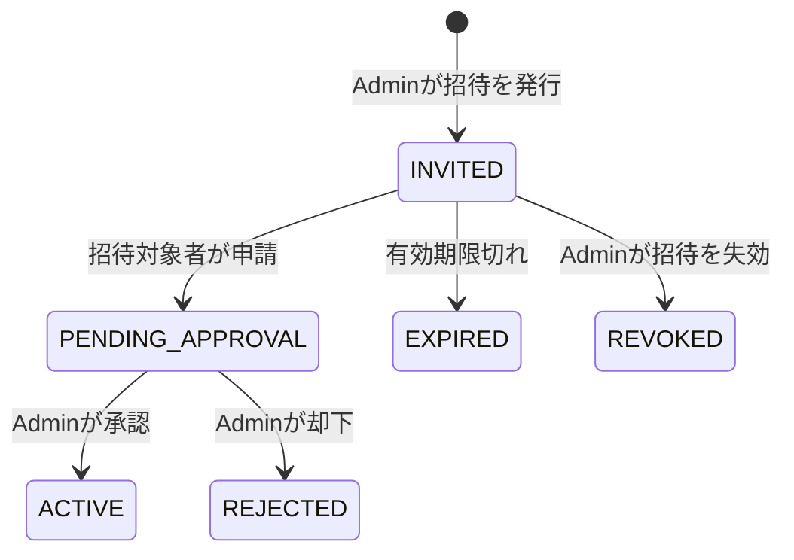

# 業務機能設計書

## 1. 文書情報

| 項目 | 内容 |
| --- | --- |
| バージョン | 1.0 |
| 状態 | 初版 |
| 対応する概要設計 | [overview-design.md](../overview-design.md) |
| 主な利用者 | プロダクト担当、フロント/バックエンド開発者、テスト担当 |

## 2. 機能一覧

| ID | 機能 | 初期リリース |
| --- | --- | --- |
| F-01 | 招待発行、申請、Admin承認/却下 | 対象 |
| F-02 | ユーザー名・パスワードによるログイン/ログアウト | 対象 |
| F-03 | トレーニング記録の作成・参照・更新・個別削除 | 対象 |
| F-04 | 種目カタログと利用者独自種目 | 対象 |
| F-05 | 定型メニューの管理とメニューからの記録開始 | 対象 |
| F-06 | 履歴検索、種目別推移 | 対象 |
| F-07 | 身長・体重測定と推移 | 対象 |
| F-08 | 本人データCSVエクスポート | 対象外 |
| F-09 | アカウント削除・本人データ全件削除 | 対象外 |
| F-10 | Spotify画面内再生 | MVP後。Premium・規約等の条件確認後に実装判断 |
| F-11 | 事前登録済み係数による消費カロリー推定 | 対象 |

初期アカウント数は一般利用者2名と開発者Admin1名の計3名を想定する。Adminは1名のみとする。

## 3. アカウント申請と承認

### 3.1 フロー

1. Adminが招待を発行する。有効期限付きの一回使用トークンを発行する。
2. 招待対象者が有効なリンクを開き、ユーザー名とパスワードを登録する。
3. サーバーはアカウントを`PENDING_APPROVAL`として作成し、招待を申請済みにする。この段階ではログインを拒否する。
4. Adminが承認待ち一覧で申請を確認し、承認または却下する。
5. 承認するとアカウントを`ACTIVE`にし、本人がログインできる。却下されたアカウントはログインできない。

### 3.2 業務ルール

- 招待がない公開登録は許可しない。
- 招待トークンは暗号学的に推測困難な乱数とし、DBにはハッシュ値を保存する。平文トークンは発行時に一度だけ表示し、ログへ出力しない。
- 招待の有効期限、失効、使用済みをサーバー側で検査し、同じ招待を二度使用できないようにする。
- ユーザー名は前後空白を除去し、大小文字の扱いを統一して一意性を検査する。
- Adminの承認前後を問わず、一般利用者が他のユーザーを承認・停止できない。
- 初期Adminは安全な初期化処理で作成し、固定パスワードをリポジトリに保存しない。
- パスワードリセット方式は未決。実装前に運用・本人確認方法を決める。

## 4. トレーニング記録

### 4.1 構造と入力規則

トレーニング記録は実施日、任意メモ、順序付きの種目項目からなる。種目項目は複数セットを持つ。

- 1セットに入力する運動量は回数または時間のいずれか一方。
- 重量は任意。入力する場合はkgで0以上。端数精度はDB設計に従う。
- 回数は正の整数。時間は正の秒数を内部値とする。画面上の入力単位は画面設計で定義する。
- 同日に複数のトレーニング記録を作成できる。日付と作成時刻で表示順を決める。
- 空のセット、空の種目項目を保存するかはAPI入力検証で統一する。初期案ではセットを1つ以上必須とする。
- 利用者が自身の記録を編集・個別削除できる。削除は子の種目項目とセットを含めて一貫して処理する。

### 4.3 消費カロリー計算

- 種目と記録形式ごとのカロリー係数（`kcal/回`または`kcal/分`）を、初期リリース前に`exercise_calorie_rates`へ登録する。
- 回数セットは`kcal_per_rep × reps`、時間セットは`kcal_per_minute × duration_seconds / 60`でセットごとの推定値を計算する。
- 係数に基づく計算はサーバー側で行う。フロントエンド表示は入力中の参考値とし、保存時にサーバーが再計算する。
- セット別推定値と適用した係数の識別子を記録時点で保存する。係数更新後も過去の推定値は自動変更しない。
- セッションの消費カロリーは、計算可能なセット別推定値の合計とする。端数処理の桁数は実装時に統一する。
- 該当する種目・記録形式の係数がない場合は推定値をNULL（未計算）とし、トレーニング記録自体は保存可能にする。UIに係数未登録を表示する。
- 消費カロリーは推定値であることを明記する。体重別係数を用いる場合は別途データを用意する必要があるため、初期版では固定係数を使う。
- 係数の算出根拠、出典、初期値、見直し担当者は実装前に決定し、マスタデータとともに管理する。

### 4.2 種目とメニュー

- 標準種目は共通カタログとして参照専用で提供する。
- 利用者独自種目は作成者本人のみ編集・削除できる。
- 定型メニューは名前、任意説明、種目の順序を持つ。初期仕様では目標回数・時間・重量はメニューに保持せず、実際の記録時に各セットへ入力する。
- メニューから記録を作成した時点で種目一覧を記録側へ複製する。以後メニューを変更しても既存記録を変更しない。

## 5. 履歴・集計

- 履歴は実施日の降順、同日の場合は作成日時の降順で表示する。
- 検索条件は期間と種目。利用者IDはログインユーザーに固定し、画面から変更できない。
- 最大重量は重量が入力されたセットの最大値とする。重量未入力のセットは対象外。
- トレーニング量は、回数と重量が両方あるセットの`重量kg × 回数`の合計とする。
- 時間セット、回数のみのセットはトレーニング量計算に含めない。時間の合計を表示する場合は別指標として扱う。
- 同一実施日に複数セッションがある場合、個々のセッションと日単位集計を混同しない。初期画面はセッション単位の詳細を表示する。

## 6. 身体測定

- 初期の測定項目は身長cmと体重kg。
- 測定は項目マスタを参照し、値、単位、測定日時を保存する。
- 同日複数回の測定を許可する。利用者ID、測定項目、測定日時で識別する。
- 将来追加の単純な数値項目は測定項目マスタに追加し、測定値テーブルに行を追加する。項目ごとの異なる単位・範囲・入力UIが必要な場合は機能追加としてレビューする。
- 初期版では身長・体重を本人のみ参照・編集・個別削除できる。追加の測定項目は後続対応とする。

## 7. CSVエクスポートと削除

- 本人データCSVエクスポートは初期リリースに含めない。将来追加時は本人データへの限定、文字コード、値形式、CSV Injection対策を別途設計する。
- 個別の記録・測定の削除は提供する。
- アカウント削除および利用者の全データ一括削除は、初期リリースでは画面・APIとも提供しない。法令・サービス運用上の削除要求に備えた運用手順は公開前に別途決める。

## 8. Spotify（MVP後）

- 連携方式はSpotify Web Playback SDKによる画面内再生を前提とする。
- Spotify Premiumが必要で、ブラウザー/端末差、特にiOSのユーザー操作要件を検証する。
- OAuth、必要なスコープ、トークン保管、Spotify Developer Terms/Policyの最新条件を実装前に確認する。
- 画面内再生の要件を満たせない場合は、連携機能を出さない。Spotifyアプリへのリンク方式への置換は行わない。

## 9. 機能受け入れ条件

- 招待済み利用者は申請後、Admin承認前にはログインできない。承認後にログインできる。
- 一般利用者は他利用者の記録・測定・メニューを参照・変更できない。
- 1セットで回数か時間のどちらか一方と任意重量を記録でき、同日に複数のトレーニングを保存できる。
- メニューから記録を開始し、メニュー変更が既存記録へ反映されない。
- 身長・体重を複数回/日記録でき、時系列で確認できる。測定項目はマスタ追加で拡張できる。
- 種目の係数が登録されている場合、回数・時間からセット別消費カロリーとセッション合計を計算し、適用係数と推定値を保存できる。
- 係数未登録でもトレーニング記録を保存でき、消費カロリーは未計算として表示される。
- F-08のCSVエクスポートは画面/APIとも初期リリースに含まれない。
- 個別記録の削除は可能だが、アカウント・全データ一括削除APIは存在しない。
