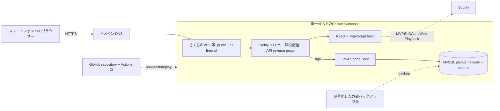

# 筋トレ記録アプリ 概要設計書

## 1. 文書情報

| 項目 | 内容 |
| --- | --- |
| バージョン | 1.1 |
| 状態 | 初版。基本方針と初期仕様を定義 |
| 作成日 | 2026-09-26 |
| 対象読者 | 企画・設計・実装・テスト・運用に関わる開発者 |

本書は、システムの目的、対象範囲、全体構成、主要な設計判断を定義する。実装時に必要なテーブル定義、API契約、画面レイアウト、業務フロー、セキュリティ詳細、開発・テスト手順は、末尾に示す担当別の詳細設計書を参照する。

## 2. 背景と目的

スマートフォンまたはPCから筋力トレーニングと身体測定を記録し、履歴や数値の推移を確認できるWebアプリを開発する。Dockerを使ったローカル環境でReact、Java、MySQLの開発を行い、コンテナ、ネットワーク、ボリューム、環境変数も学習対象とする。

初期利用者は一般利用者2名と開発者Admin1名の合計3アカウントを想定する。公開費用は無料を優先するが、永続性やバックアップの制約がある場合は少額の有料サービスも選択肢とする。

## 3. 対象範囲

### 3.1 初期リリース（MVP）

- 招待制アカウント、Adminによる有効化承認、ユーザー名とパスワードによるログイン
- アカウントごとに分離されたトレーニング記録
- 種目ごとにセットを記録。セット内容は回数または時間のいずれか一方と任意重量
- 種目ごとの事前登録済みカロリー係数を使った消費カロリー推定と記録
- 種目一覧、利用者独自種目、定型メニュー、トレーニング履歴と推移
- 身長・体重の測定記録。同日の複数記録を許可し、測定項目を将来追加できる構造
- 個別のトレーニング・測定記録の編集と削除
- スマートフォンとPCに対応するレスポンシブWeb画面
- Docker Composeを用いたローカル開発環境

### 3.2 初期リリース対象外

- 本人データのCSVエクスポート
- アカウント削除および利用者の全データ一括削除
- 不特定多数向け公開登録、他利用者とのデータ共有、SNS、課金
- ネイティブアプリ、オフライン同期
- Spotify連携（MVP後に画面内再生を追加する方針）
- 医療・診断目的の機能

## 4. 利用者と権限の概要

- **一般利用者**: 初期2名。本人の記録・測定の登録、閲覧、修正、個別削除を行う。
- **Admin**: 開発者1名。招待の発行とアカウント申請の承認・却下を行う。通常画面から他人のトレーニング詳細は閲覧できない。
- 招待対象者が登録申請した時点では承認待ちとし、Adminの承認後にログイン可能とする。
- 一般利用者間のデータアクセスは許可しない。API側で必ず本人確認を行う。

## 5. 全体構成

| 領域 | 採用方針 |
| --- | --- |
| フロントエンド | React + TypeScript。静的ビルドをCaddyから配信 |
| バックエンド | Java + Spring Boot。認証・認可、業務処理、REST APIを担当 |
| DB | 開発・初期公開ともMySQLを基本とし、Compose内のprivate networkに配置 |
| DB変更管理 | Flyway等のバージョン管理されたマイグレーション |
| ローカル環境 | Docker ComposeでCaddy相当のproxy、frontend、backend、MySQLを起動 |
| 初期公開案 | 1台の低価格VPS（例: さくらのVPS）にDocker Composeで配置。サービス・プランは契約前に再確認 |
| DNS/TLS | 独自ドメインとDNS。CaddyがLet's Encrypt証明書を自動管理する案 |
| CI | GitHub Actionsでテスト・ビルド。デプロイ自動化は秘密情報管理を確認後に有効化 |
| Backup | VPSとは別の保存先へ暗号化したDBバックアップを保管する案 |

単一VPS構成は構成が理解しやすく、Docker/MySQLを学ぶ目的に合う一方、VPS障害がアプリとDBの両方に影響する。DBポートは公開せず、SSHは鍵認証に限定する。バックアップ保存先、ドメイン費用、VPS月額は無料とは限らないため、初期公開前に予算と復元性を確定する。詳しい配置・代替案は[アーキテクチャ設計書](architecture.md)、運用詳細は[インフラ・運用設計書](detailed-design/infrastructure-design.md)を参照する。

## 6. 主要な設計方針

- **利用者データの分離**: 対象ユーザーIDはログインセッションから取得する。リクエストで指定されたuserIdを認可判断に使用しない。
- **健康関連情報の最小化**: 初期の測定項目は身長・体重とし、項目マスタを使って将来の追加に対応する。
- **消費カロリー**: 種目ごとのカロリー係数を事前にDBへ登録し、セットの回数または時間から推定値を計算して記録する。推定値であることを画面で明示する。係数の出典・改訂は別途管理する。
- **記録の拡張性**: セットは回数または時間の一方を持ち、重量は任意とする。時間は秒で保持する案。
- **アカウント状態**: 招待後の申請は承認待ちとし、Adminのみが有効化する。
- **削除範囲**: 個別記録の削除は可能。アカウントと全データの一括削除は初期リリースで提供しない。
- **データエクスポート**: CSVエクスポートは初期リリース対象外。

詳細な業務ルールは[業務機能設計書](detailed-design/functional-design.md)、テーブルと制約は[データ設計書](detailed-design/data-design.md)、APIと画面の契約は各詳細設計書を参照する。

## 7. 公開・費用方針

初期公開案は単一の低価格VPS上で、Caddy、React静的ファイル、Spring Boot API、MySQLをDocker Composeで運用する。MySQLは公開ネットワークに出さない。ドメイン、VPS、バックアップ領域が有料となる可能性を踏まえ、契約前に月額費用を確認する。

将来、可用性や保守負荷を改善する必要があれば、静的ホスティング、Java API実行環境、マネージドMySQL互換DBへ分離する。TiDB Cloud Starter等を候補とする場合も、無料枠・SQL互換性・バックアップ・復元・停止・課金条件をその時点の公式情報で確認する。料金や無料枠を恒久保証として扱わない。

## 8. Spotify連携方針

Spotify連携はMVP後の機能とし、画面内再生を前提とする。Web Playback SDKにはSpotify Premiumが必要で、iOS等ではユーザー操作が必要となる制約がある。Spotifyの最新規約・開発者ポリシー・認証条件を実装前に確認する。条件を満たせない場合は連携機能を提供しない。詳細は[業務機能設計書](detailed-design/functional-design.md)を参照する。

## 9. 詳細設計書一覧

| 文書 | 主な対象 |
| --- | --- |
| [設計書一覧](detailed-design/README.md) | 文書の読み方、担当境界、更新ルール |
| [業務機能設計書](detailed-design/functional-design.md) | 利用フロー、業務ルール、状態遷移、カロリー計算、受け入れ条件 |
| [データ設計書](detailed-design/data-design.md) | ER図、テーブル・カラム定義、制約、インデックス、マイグレーション |
| [API設計書](detailed-design/api-design.md) | エンドポイント、認証、リクエスト/レスポンス、エラー |
| [画面設計書](detailed-design/screen-design.md) | ナビゲーション、画面レイアウト、入力・表示状態、レスポンシブ方針 |
| [セキュリティ設計書](detailed-design/security-design.md) | 認証・認可、セッション、CSRF、秘密情報、プライバシー |
| [インフラ・運用設計書](detailed-design/infrastructure-design.md) | Docker開発環境、環境設定、公開候補、バックアップ・運用 |
| [テスト設計書](detailed-design/test-design.md) | テストレベル、重要ケース、受け入れ基準、実施ゲート |
| [アーキテクチャ設計書](architecture.md) | 配置図、サービス構成、通信経路、公開案と代替案 |

## 10. 実装前に確認する事項

1. 招待を受け取る方法と、申請・Admin承認の具体的な運用。
2. パスワードリセットを初期リリースに含めるか、本人確認をどう行うか。
3. 身長・体重以外に追加する測定項目の表示名、単位、入力範囲。
4. 消費カロリー係数の算出根拠、適用単位、対象種目、係数の初期データと改訂責任者。
5. 本番ホスト、ドメイン、予算上限、バックアップ保存先と頻度。VPSの実サービス・プランは契約前に確認する。
6. Spotify連携実装時の規約・Premium要件・アプリ登録条件。
7. 公開前に各サービスの料金・利用条件を確認する担当者と確認日。
